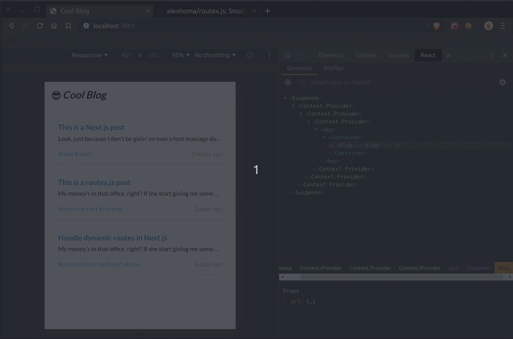

<h1 align="center">Routex.js</h1>
<p align="center">Yes, another library to handle <strong>dynamic routes in Next.js</strong></p>

<p align="center">
  <a href="https://www.npmjs.com/package/routex.js">
    
  </a> 
  <a href="https://travis-ci.com/alexhoma/routex.js">
    
  </a> 
  <a href="https://codecov.io/gh/alexhoma/routex.js">
    
  </a> 
  <a href="https://bundlephobia.com/result?p=routex.js">
    
  </a> 
  <a href="https://bundlephobia.com/result?p=routex.js">
    
  </a>
</p>

<br />

## Features

- :milky_way: Universal
- :leaves: Tree shakeable
- :ant: Not tiny, but pretty small
- :link: Build your custom `<Link />` on top of it
- :tada: Same routes contract as [next-routes] `name, pattern, page`
- :rocket: Up to date `path-to-regexp` dependency
- :earth_africa: Compatible with [routes localization]
- :sunglasses: Cool name!

Inspired by [next-routes] and [next-minimal-routes].

## Install

Install routex in your Next.js project:

```
npm i routex.js
```

Using yarn:

```
yarn add routex.js
```

## Setup

### Route definitions

Okay, so now we have installed routex. First of all we'll need to declare
our application routes. So let's create a `routes.js` file:

```javascript
module.exports = [
  {
    name: 'index',
    pattern: '/',
  },
  {
    name: 'post',
    pattern: '/post/:slug',
    page: 'post',
  },
  {
    name: 'tags',
    pattern: '/tags{-:id}?', // optional id param
    page: 'tags',
  },
];
```

> If you need more info on how to create the route patterns
> check the `path-to-regexp` documentation: [pillarjs/path-to-regexp].

### Server `getRequestHandler()`

Once routes are declared, we want to handle it whenever a user loads any existing url
in our application. So here we need to create our routex `requestHandlerMiddleware` in our `server.js` file,
passing the next.js instance (`nextApp`) and our route definitions (`routes`) like this:

```javascript
const express = require('express');
const next = require('next');
const nextApp = next({ dev: process.env.NODE_ENV !== 'production' });
const routes = require('./routes');
const { getRequestHandler } = require('routex.js');

const routexHandlerMiddleware = getRequestHandler(nextApp, routes);

nextApp.prepare().then(() => {
  express()
    .use(routexHandlerMiddleware);
    .listen(3000);
});
```

### Client `link()`

Hooray! our server now handles dynamic routes. But now we need a way to create link
components to point to that dynamic routes. So let's create a file `CustomLink.js` to use
in our components.

```javascript
import NextLink from 'next/link';
import { createRouteLinks } from 'routex.js';
import routes from './routes';

const { link } = createRouteLinks(routes);

export default function CustomLink({ children, route, params }) {
  return (
    <NextLink {...link({ route, params: { ...params } })}>
      <a>{children}</a>
    </NextLink>
  );
}
```

The `createRouteLinks` function transforms and closures all your routes and returns
a new `link` function. This `link` is the one that will provide to the `<NextLink />` component
the `as` and `href` props. And it needs this two parameters:

- `route`: a route name, the one that you have in the route definiton.
- `params`: all dynamic params

And this is how you'll use your `<CustomLink />` component:

```javascript
import CustomLink from './CustomLink';

export default () => (
  <>
    This is an example page component:
    <CustomLink
      route="post"
      params={{
        slug: 'next-js-post',
      }}
    >
      Next.js post link
    </Link>
  </>
);
```

The output that will return your `<CustomLink />` will be exactly the same that if
you create a link using the current Next.js Link, like I'll show you in this example:

```javascript
import NextLink from 'next/link';

export default () => (
  <NextLink as="/post/next-js-post" href="/post?slug=next-js-post">
    <a>Next.js post link</a>
  </NextLink>
);
```

Currently, there is no imperative way to change your app route using `routex.js`,
like the next-routes' `Router.pushRoute(route, params, options)`, because I didn't need it at all in my current applications.
But I'm open to add it if someone finds it interesting. Since then, I'll try to keep this library as simple as possible.

> For more information have a look into the [example app](./examples) directory.

## Demo



## Motivation

Check out this blog post to know some of the reasons why I've decided to create another routing library: [alexhoma.com/projects/routexjs-yet-another-router-for-nextjs]

## Things to do

- [x] Add an example with multi-domain application
- [ ] Since routex.js doesn't need React at all, add an example with other Next.js integrations, like Preact, inferno, etc.
- [ ] Avoid loading all route definitions in client side, only the ones we use per page

## Contributions

If you want to suggest a change, feature or any question, feel free to open an issue or a pull request.

[npm-version]: https://badgen.net/npm/v/routex.js
[travis-build]: https://travis-ci.com/alexhoma/routex.js.svg?branch=master
[bundlephobia-min-badge]: https://badgen.net/bundlephobia/min/routex.js
[bundlephobia-minzip-badge]: https://badgen.net/bundlephobia/minzip/routex.js
[next-routes]: https://github.com/fridays/next-routes 'fridays/next-routes'
[next-minimal-routes]: https://github.com/lydell/next-minimal-routes 'lydell/next-minimal-routes'
[routes localization]: ./examples/with-route-localization
[pillarjs/path-to-regexp]: https://github.com/pillarjs/path-to-regexp
[alexhoma.com/projects/routexjs-yet-another-router-for-nextjs]: https://alexhoma.com/projects/routexjs-yet-another-router-for-nextjs/
