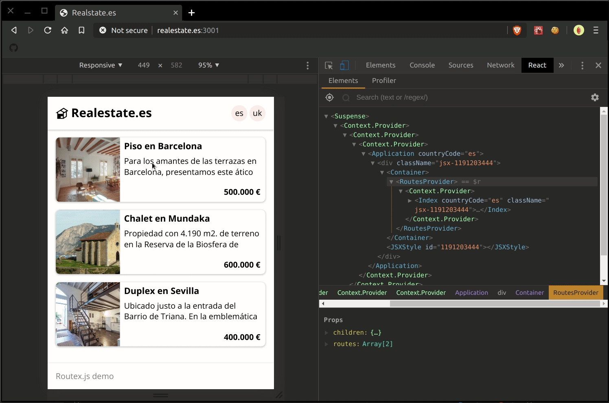

# Routes localization example

Using Routex.js in a Next.js project that needs translated routes depending on which country code top level domain is loaded (ccTLD).

This is an example of a **real estate** company that have two websites
`realestate.es` and `realestate.co.uk` into the same project, the Next.js codebase is the same for the two websites because the only that changes is the data comming from the API.

## :wrench: Setup

Install npm dependencies:

```
npm install
```

To make this demo work you need to add this lines into your `/etc/hosts` file:

```
127.0.0.1 realestate.es
127.0.0.1 realestate.co.uk
```

Then run the app and go to `realestate.es:3001` or `realestate.co.uk:3001`:

```
npm start
```

## Demo



## :question: Questions

If you have any doubt, **WHAT THE F\*\*\*** are you waiting for to [open an issue](https://github.com/alexhoma/routex.js/issues/new)?!? :P
